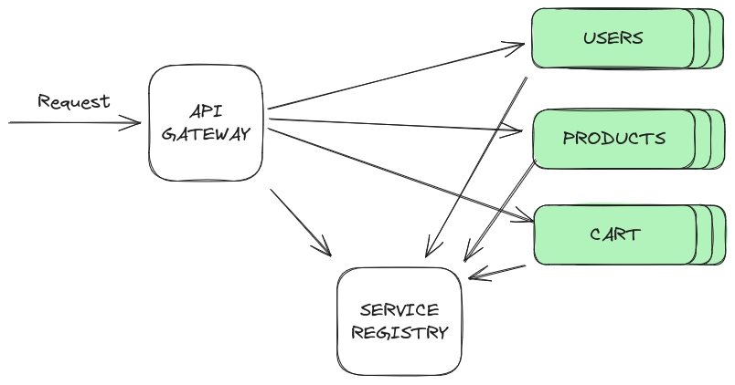

# Arquitetura de Microserviços em NodeJS

Este repositório é focado na implementação e compreensão de uma arquitetura de microserviços utilizando NodeJS. Em fase de desenvolvimento, ele serve como uma plataforma de aprendizagem para explorar conceitos chave como API Gateway, Load Balancing, Service Discovery e microserviços.

Com o auxílio do Docker e Docker Compose para simular um ambiente de microserviços de forma isolada e controlada, proporcionando uma experiência de aprendizagem prática e interativa.

## Diagrama
<p align="center">
  
</p>

## Componentes

- **API Gateway com Load Balancer e Service Discovery (WIP)**: Age como ponto de entrada único para os microserviços, distribuindo as requisições de forma inteligente entre as instâncias disponíveis e localizando serviços dinamicamente.
- **Service Registry (WIP)**: Mantém um registro de todos os serviços disponíveis na arquitetura, permitindo que sejam localizados e consumidos por outros microserviços ou pelo API Gateway.
- **User Microservice (WIP)**: Responsável pelo gerenciamento de usuários, incluindo operações como criação, consulta, atualização e exclusão de usuários.

## Tecnologias Utilizadas

- NodeJS: Runtime de JavaScript para a construção dos microserviços.
- Total.js: É um framework para a plataforma Node.js escrito em JavaScript puro, semelhante ao Laravel do PHP, ao Django do Python ou ao MVC do ASP.NET. Pode ser usado como aplicativo web, desktop, serviço ou de IoT
- Docker e Docker Compose: Para simulação do ambiente de microserviços em containers, facilitando o desenvolvimento, testes e deploy.

## Pré-requisitos

Antes de começar, você precisa ter o Docker e o Docker Compose instalados na sua máquina.

## Configuração e Execução

1. Clone o repositório:

```bash
git clone https://github.com/lsfratel/microservice-architecture
```

2. Navegue até a pasta do projeto e construa os serviços com o Docker Compose:

```bash
cd microservice-architecture
docker-compose up --build
```

3. Os serviços estarão acessíveis através dos endpoints definidos no API Gateway.
